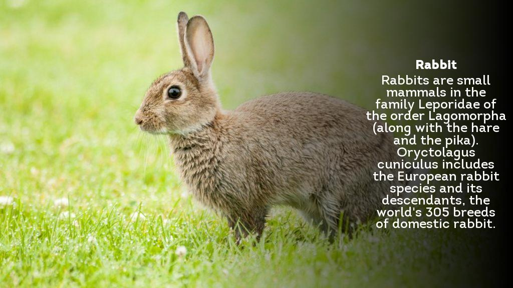

Just run `cards_generator.py` and it will say what files you need to download/create/etc.

## Here's one example of how it works:

Input:

Config:

    >rabbit.jpg
    Rabbit
    Rabbits are small mammals in the family Leporidae of the order Lagomorpha (along with the hare and the pika). Oryctolagus cuniculus includes the European rabbit species and its descendants, the world's 305 breeds of domestic rabbit.

Also, you need to add bold and regular fonts.

Output:

(This example can be found in the `example_files` folder)
